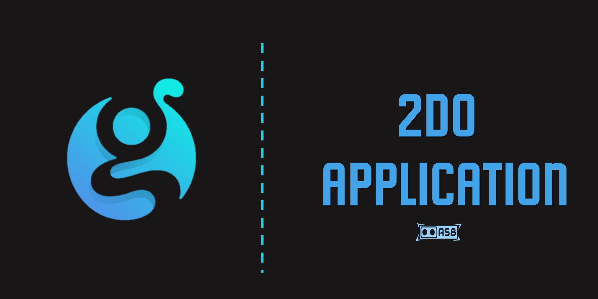

# 2Do-Application
A simple Django todo app that helps on managing daily tasks 📐

This is the very first application which I have created using Django and deployed using Heroku. 

Use this application on: [https://todo-application-as8.herokuapp.com/](https://todo-application-as8.herokuapp.com/)

It is consist of:
  - Cover Page
  - Login Page
  - SignUp Page
  - View Tasks Page
  - Add New Task Page
  - Delete Task Page
  - Update Task Page

 

# Development Guidelines
There are not much scope of development. But if you want to take this app to the next level, I will highly appreciate. You need to just,
 - Fork this repository
 - Clone it in your local machine
 - Install all the requirements from [requirements.txt](requirements.txt)
 - Develop this application
 - Push you code to GitHub
 - Create a Pull Request
 - If you face any problem, create an issue

 

# License
Details can be found in [LICENSE](LICENSE)
